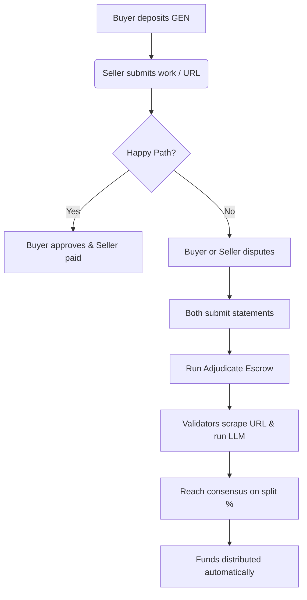

# ArbitratedEscrow - Intelligent Contract Primitive

An educational, reusable, and robust GenLayer Intelligent Contract primitive implementing a **Decentralized Escrow Registry with AI-Validator Arbitration**.

Traditional blockchain escrow contracts are structurally limited because they can only resolve disputes deterministically (e.g., via a simple API check or a trusted third-party oracle multisig). This primitive showcases how GenLayer allows contracts to resolve subjective, real-world agreements (like freelance contracts or trade disputes) autonomously using decentralized AI-validator consensus.

---

## 💡 How It Works & Use of Consensus

The contract uses GenLayer's **Equivalence Principle** and Large Language Models (LLMs) to arbitrate disputes.



### 1. The Escrow State Machine
An escrow goes through the following statuses:
*   `AWAITING_DEPOSIT`: Buyer creates the escrow with the agreement text and seller address.
*   `ESCROWED`: Buyer calls `deposit()` and locks the native `GEN` tokens in the contract.
*   `DELIVERED`: Seller calls `submit_delivery()` and submits a text description or a web URL pointing to their work.
*   `DISPUTED`: If there is a dispute, either party calls `dispute_escrow()` to lock the funds and submit their side of the story.
*   `RESOLVED` / `REFUNDED`: The final state after manual approval, voluntary refund, or automated AI arbitration.

### 2. AI Consensus Adjudication Logic
When `adjudicate_escrow(escrow_id)` is triggered:
1.  **Web Scraping (Non-Deterministic):** If the seller's delivery artifact is a URL, the validator node fetches the live content using `gl.nondet.web.render(url, mode="text")`.
2.  **LLM Inference (Non-Deterministic):** An LLM prompt is executed:
    *   It reviews the original **Contract Agreement**, the **Delivery Artifact** (and its fetched web page content), the **Buyer's Dispute Statement**, and the **Seller's Dispute Statement**.
    *   It determines who is in the right and allocates a payout percentage (from `0%` to `100%`) to the seller, returning the remaining funds to the buyer.
3.  **The Equivalence Principle (`gl.eq_principle.strict_eq`):** A leader validator proposes the allocation and reasoning. Other validator nodes verify the proposal against the criteria (fairness, logical reasoning, and proper JSON format). Once a consensus is reached, the result is written back to the chain.
4.  **Payout Distribution:** The contract automatically splits the escrow balance and transfers `X%` to the seller and `(100 - X)%` to the buyer.

---

## 🛠️ State Design & API Reference

### Storage Struct: `EscrowRecord`
```python
@allow_storage
@dataclass
class EscrowRecord:
    id: u256                      # Unique ID
    buyer: Address                # Buyer address
    seller: Address               # Seller address
    amount: u256                  # Escrowed amount in wei
    status: str                   # State machine status
    agreement_desc: str           # The natural language contract agreement
    delivery_artifact: str        # Text description or URL of the delivered work
    dispute_buyer_statement: str  # Buyer's claim during a dispute
    dispute_seller_statement: str # Seller's claim during a dispute
    resolution_reason: str        # Reasoning provided by the AI validators
    payout_seller_percent: u256   # 0-100 percentage paid to the seller
```

### Write Methods
*   `create_escrow(seller_address: str, agreement_desc: str) -> u256`
    *   *Callable by:* Anyone (Buyer).
    *   *Purpose:* Registers a new escrow and returns the unique ID.
*   `deposit(escrow_id: u256)`
    *   *Callable by:* The Buyer.
    *   *Decorator:* `@gl.public.write.payable`
    *   *Purpose:* Locks the transaction value (`gl.message.value`) into the escrow.
*   `submit_delivery(escrow_id: u256, delivery_artifact: str)`
    *   *Callable by:* The Seller.
    *   *Purpose:* Uploads the delivery proof (text or URL).
*   `approve_delivery(escrow_id: u256)`
    *   *Callable by:* The Buyer.
    *   *Purpose:* Releases 100% of the locked funds to the seller.
*   `refund_buyer(escrow_id: u256)`
    *   *Callable by:* The Seller.
    *   *Purpose:* Voluntarily returns 100% of the funds to the buyer.
*   `dispute_escrow(escrow_id: u256, statement: str)`
    *   *Callable by:* The Buyer or Seller.
    *   *Purpose:* Signals a dispute and records the party's explanation.
*   `adjudicate_escrow(escrow_id: u256)`
    *   *Callable by:* Anyone (usually buyer/seller).
    *   *Purpose:* Triggers the AI consensus arbitration and payouts.

### View Methods
*   `get_escrow(escrow_id: u256) -> EscrowRecord`
    *   *Purpose:* Fetches the current state of the escrow.

---

## 🧪 Local Testing Guide

Unit tests are written using the `genlayer-test` Direct Mode in-memory VM framework, allowing tests to run in milliseconds without launching a full simulator or Docker container.

### Running Tests
1.  Navigate into the project directory:
    ```bash
    cd intelligent-contracts
    ```
2.  Install the testing dependencies:
    ```bash
    pip install pytest genlayer-test
    ```
3.  Execute the test suite:
    ```bash
    pytest tests/
    ```

### Mocking Mechanics in Tests
Because AI arbitration calls are non-deterministic, the test suite (`tests/test_arbitrated_escrow.py`) simulates these using `direct_vm` mock methods:
*   **Web Scrape Mocks:**
    ```python
    direct_vm.mock_web(r".*logo-draft\.svg", {"status": 200, "body": "<svg>Mock SVG data</svg>"})
    ```
*   **LLM Decision Mocks:**
    ```python
    decision_json = '{"payment_to_seller_percentage": 60, "reasoning": "Completed shapes but missed smoothing."}'
    direct_vm.mock_llm(r".*arbitrator.*", decision_json)
    ```
